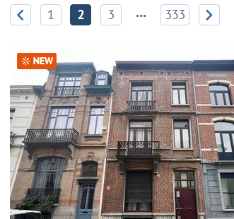

# ORACLE ● ESTATE

## Description

Oracle Estate is a robust and reliable designed to extract, structure, and save real estate data from the immoweb.be website. It is based on scrapy.

#### Program Workflow

* It traverses search pages on the site, collecting URLs of properties for sale
* It extracts details of each property, such as id, address, price, etc.
* It extracts and stores all field names that it found
* It structures the extracted data, adhering to a predefined list of authorized fields.
* It saves the structured data in JSON and CSV files for later use.
* It displays the total execution time of the process.

#### Strengths
* Scalability and Flexibility: Initially using Requests and BeautifulSoup for prototyping, we are now harnassing the power of Scrapy. Scrapy efficiently manages HTTP requests and CSS parsing. It additionally deals with requests asynchronously and handles concurrency very nicely.

* Data Structuring: By structuring the extracted data according to a predefined list of authorized fields and remapping certain values, the program ensures data consistency, facilitating their manipulation.

* Data Backup: Saving extracted data in JSON and CSV files offers great portability and allows them to be used in different contexts and with different data analysis and processing tools.

* Error Handling: Since Scrapy handles all connection errors by itself, we can focus on other issues.


## Timeline

### Day 1 - Project Understanding:
- Clarification of our objectives.
- Git repository creation.
- Discussion on program structure and expected features, tool selection: Scrapy, BeautifulSoup, Python, etc.
- Wdho wants to do what:
    "Everyone does everything, we put everything together and see how each person did it
     to discuss it for the purpose of improvement and learning."

### Day 2 - Program Development:
- Each person develops independently to discover the problems and the questions that arise.
- A few more hours of development, and we hope to reach the First Working Prototype.

### Day 3 - Program Development:
- Decision made to use Scrapy to efficiently handle HTTP requests.
- Everyone switches to reading mode to discover Scrapy and its functionalities.
- Implementation of the web crawler (Scrapy to collect property URLs).
- Error and exception handling.
- Integration of BeautifulSoup for extracting property details.
- The prototype works with Scrapy.

### Day 4 - Program Development:
- Bug fixes and identified issues addressed.
- (Improvements in the structure of extracted data.)
- Challenges encountered in finding certain fields.(adress)
- Reflections on data usage and data cleaning.
  - cleaning algorithms, Consideration of implementing the "Jaccard algorithm."

### Day 5 - Documentation and Finalization:
- Code review
- Writing the README file.
- Preparation of the final project presentation.

<br>
<br>

# DEV LOG

## Cracking the code

### Scraping search-result pages for property urls
- Using simple session requests, with small sleep timeout
- Leveraging the power of immoweb's own search query
- Scraping 333 pages with 60 urls each
- BeautifulSoup to extract relevant urls
- Storing urls to `TXT` file

### Scraping property pages for specs
- Custom ImmoSpider class inheriting Spider class from Scrapy module
- Launching Scrapy from within the script
- Parsing html table rows to extract attributes
- Storing attriutes to `JSON` file as a list of dictionaries

<br>
<br>

## Preparing for unforseen consequences...

### Duplicate URLS


We have noticed that some many listings contain the same address. Some could duplicates could be filtered by going through the data and removing any points that have the same address. Some listings however only show the agency's address. For this a new approach is necessary.

Other duplicates may be attributed to identical listings across different pages of search results, often marked as "new". To resolve this issue, we can simply add urls to a set, ensuring the elimination of duplicates.

As demonstrated in the example below:

<br clear = "right">

```python
    def scrape_urls(self, url: str):
        ...
        
        url_set = set()
        
        for property_url in property_urls:
            url_set.add(property_url["href"])

        self.saved_set_of_urls.update(url_set)
```

### Shifting strategies
This first approach becomes redundant when we decide to switch over to Scrapy entirely. Followup requests can be sent asynchronously, and data can be processed as it flows in. BeautifulSoup is no longer necessary.

Our initial solution to resolve duplicate urls also becomes obsolete thanks to Scrapy's built-in dupefilter.

### Some missing fields
Dynamically loaded content is likely to be a culprit. Further investigation is needed.

### 200K!?
People are talking, saying it might not just be a legend. We've figured out a trick, but we're still a long way from those results.

<br>
<br>

## Unveiling the Matrix

A journey into the heart of the data begins as we decode the patterns, and unlock the potential within. Our quest will involve harnessing the power of `pandas` and `numpy`, `matplotlib` or possibly `plotnine` and any other relevant libraries we might discover.

<br>
<br>

## What's next?

We might need to delve into `scrapy-selenium` or `scrapy-splash` to deal with dynamically loaded content.

<br>
<br>

## Sources

#### Learning resources
- https://gist.github.com/Alinaprotsyuk/3d58f8cd52eb03a11283d64beb0e083e
- https://docs.scrapy.org/en/latest/intro/tutorial.html#intro-tutorial

#### Markdown goodies
- https://medium.com/swlh/how-to-make-the-perfect-readme-md-on-github-92ed5771c061
- https://www.alt-codes.net/circle-symbols
- https://daringfireball.net/projects/markdown/syntax#html

## Contributors

<div style="display: flex; align-items: center;">
    <a href="https://github.com/Huraqan">
        
    </a>
    <a href="https://github.com/pr0fi7">
        
    </a>
    <a href="https://github.com/neverforgetthisusername">
        
    </a>
</div>